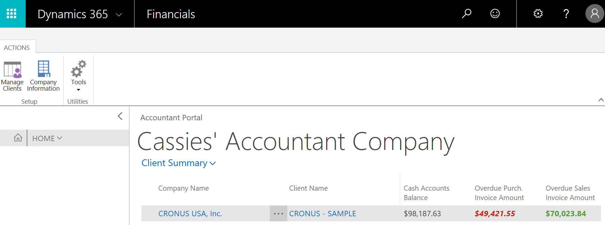

# Portal para contadores para Dynamics NAV
Esta aplicación proporciona un panel de cliente con datos de resumen de cada cliente de un contable. El portal muestra los KPI financieros así como un vínculo directo a la aplicación financiera del cliente.  

El panel incluye un Área de tareas muy especializada que sirve para disponer de un mejor resumen de los clientes.  

Al instalar la extensión por primera vez, se muestra una empresa de ejemplo que lo ayudará a empezar. Puede eliminar la empresa de ejemplo en cualquier momento.  

## Instalar la extensión
Al instalar la extensión en [!INCLUDE[d365fin](includes/d365fin_md.md)], se le preguntará si desea usarla ahora. Si lo hace, deberá cerrar la sesión e iniciarla de nuevo, porque la extensión reemplaza a su Área de tareas actual y agrega permisos a su perfil de usuario.  

Para obtener más información, vea [Experiencias contables en Dynamics NAV](finance-accounting.md).  

> [!NOTE]  
>  La versión actual de la extensión requiere que sus clientes usen [!INCLUDE[d365fin](includes/d365fin_md.md)].  

## Mediante la extensión
Se utiliza esta extensión al registrarse en [Dynamics NAV para contadores en Microsoft.com](https://www.microsoft.com/en-us/dynamics365/financial-insights-for-accountants). Si instala la extensión en [!INCLUDE[d365fin](includes/d365fin_md.md)], se sustituirá su área de tareas actual. Si posteriormente desea volver a la otra área de tareas, puede hacerlo en Mi configuración. Para obtener más información, vea [Procedimiento: Cambiar el Área de tareas](change-role.md)  

## Consulte también
[Experiencias contables en Dynamics NAV](finance-accounting.md)  
[Finanzas](finance.md)  

